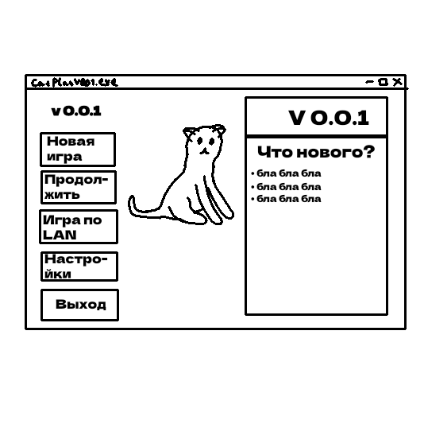

# Техническое задание

1. Project Name. Название проекта
2. Authors:
   - Team Lead: Васильев Дмитрий Вячеславович
   - Project Developers: Васильев Дмитрий Вячеславович, Агеев Ярослав Викторович
   - Teacher: Анатольев Алексей Владимирович
3. Description of the program.
   - Что должно происходить в твоей игре от момента старта кода, до завершения работы всего приложения? Опиши возможные правила игры (сценарий игры).
       > Должно быть главное меню, настройки, возможно игра по локальной сети. При нажатии на кнопку играть будет отображатся игра, платформер про котов, так же мы планируем сделать там небольшой сюжет, чтобы было интереснее играть. Можно сохранить игру а также выйти. При вызоже вас перенесет обратно в главное меню.
   - Как должна запускаться игра, как ты планируешь оформить стартовое меню? Т.е. что на нем должно находиться?
       > В главном меню должны быть несколько кнопок: Новая игра для создания новой игры, загрузить игру для загрузки предыдущей, настройки игры, возможно игры по локальной сети, выход из игры
4. Project Description.
   - Схема главного меню:
       > 
5. Program code plan.
   - Переменные, константы:
       > - Переменные для здоровья и атаки персонажей
   - Функции:
       > - Функции для разных действий персонажа и других событий
   - Классы:
       > - Для каждого обьекта будут классы
   - Библиотеки:
       > - pygame
